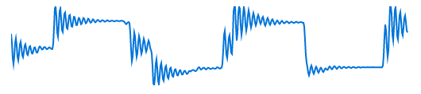
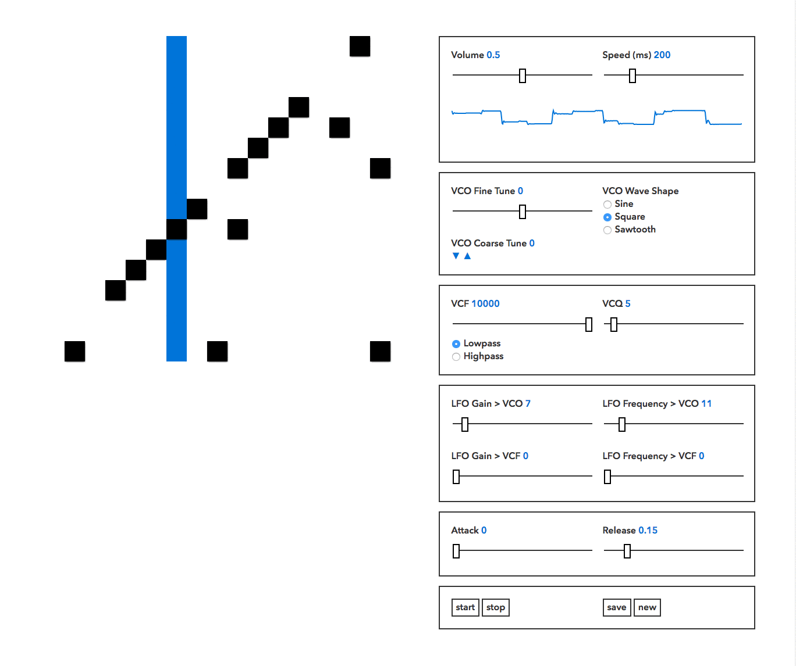

# sounds_cool

sounds_cool is a browser-based, fully analog-modeled synthesizer with sequencer. Developed using the Web Audio API, a user has full control over the synthesizer's pitch, filter, envelope and modulation parameters. The sequencer is connected to a custom made API which will store and recall a user's patterns on the fly.

*Currently in development*. You can play with demo [here](https://seanpierce.github.io/sounds_cool/)

### Authors
Sean Pierce Sumler, Aubrey Masten

### Contact
sumler.sean@gmail.com

### License
MIT &copy; 2017, Sean Pierce Sumler and Aubrey Masten
